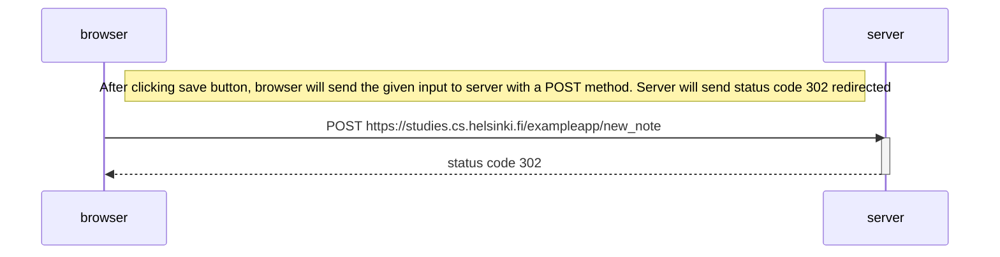

```mermaid
sequenceDiagram
    participant browser
    participant server

    Note right of browser: After clicking save button, browser will send the given input to server with a POST method. Server will send status code 302 redirected

    browser->>server: POST https://studies.cs.helsinki.fi/exampleapp/new_note
    activate server
    server-->>browser: status code 302
    deactivate server
    
```